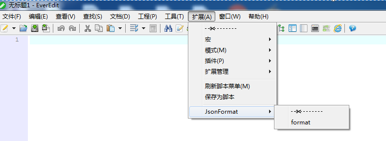

# macro_for_EverEdit
【自用】开发EverEdit扩展macro

## 使用步骤

* [EverEdit官网](http://www.everedit.cn/) 下载软件进行安装；
* 将项目中macro下的文件夹直接放到所安装的软件下得macro目录，重启编辑器或刷新扩展即可；`见图1`
* 创建快捷键：工具-设置-快捷键，然后点击绑定脚本，选中目录macro\JsonFormat\format.ejs，新建快捷键下方有一个文本域，我的快捷键为Ctrl+Alt+L，然后点击分配，完成；

> 注意：优先使用选区文本，如果没有选区则使用整个文档文本；`见例子3`

图1：

## 例子

例1：

    {"a":"a", "b":"b"}
    输入Ctrl+Alt+L转换后
    {
        "a": "a",
        "b": "b"
    }

例2：
    
    {a=a,b=b}
    输入Ctrl+Alt+L转换后
    {
        a=a,
        b=b
    }

例子3：

    {a=a,b=b,c={d=d,e=e,f={g=g,h=h}}}
    选中c={d=d,e=e,f={g=g,h=h}}, 输入Ctrl+Alt+L转换后
    {a=a,b=b,c={
        d=d,
        e=e,
        f={
            g=g,
            h=h
        }
    }}
    